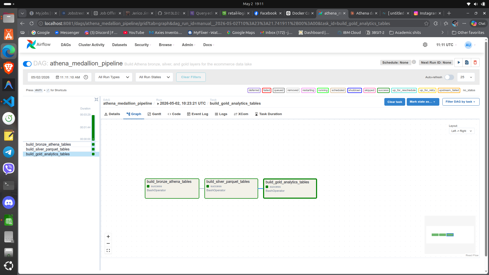
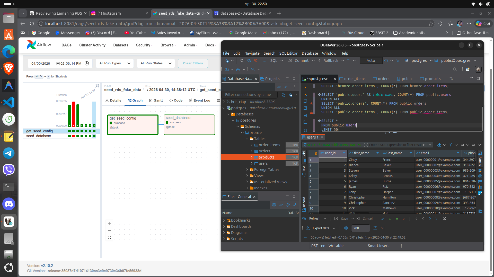
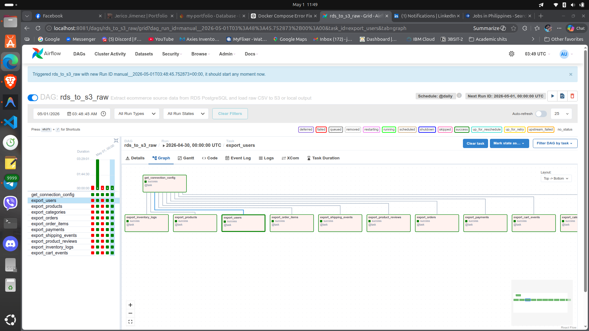
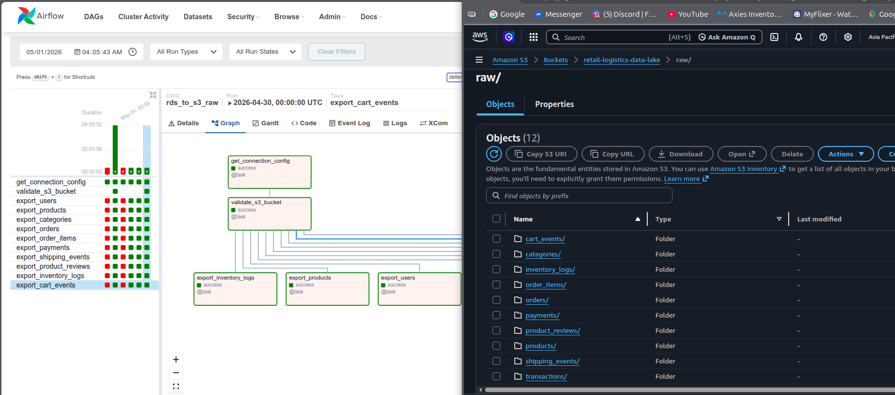
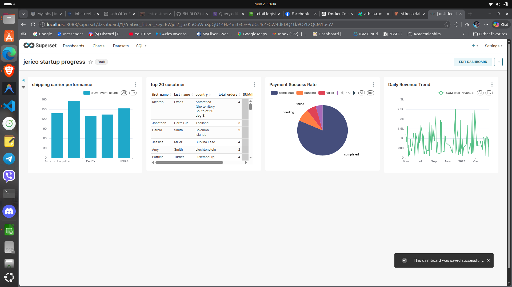

# AWS Ecommerce Data Platform

End-to-end ecommerce data engineering project that simulates a production-style AWS analytics pipeline. The platform generates transactional ecommerce data, loads it into PostgreSQL in an Amazon RDS-style source schema, extracts raw CSVs with Apache Airflow, lands immutable bronze data in Amazon S3, builds Silver and Gold layers in Amazon Athena, and visualizes analytics in Apache Superset.

## Architecture



```text
Faker data generator
        |
        v
PostgreSQL / Amazon RDS-style source
        |
        v
Apache Airflow DAGs
        |
        v
Amazon S3 bronze layer, raw CSV, date partitioned
        |
        v
Amazon Athena + AWS Glue Data Catalog
        |
        +--> Bronze database: external CSV tables
        |
        +--> Silver database: cleaned typed Parquet tables
        |
        +--> Gold database: analytics aggregates in Parquet
        |
        v
Apache Superset dashboard
```

## Technical Stack

| Area | Technology | Purpose |
| --- | --- | --- |
| Data generation | Python, Faker | Creates realistic ecommerce entities and event records |
| Source database | PostgreSQL, Amazon RDS pattern | Stores normalized OLTP-style ecommerce tables |
| Orchestration | Apache Airflow 2.10.2 | Runs seed, extract, and Athena medallion workflows |
| Runtime | Docker Compose | Runs Airflow, PostgreSQL metadata DBs, and Superset locally |
| Raw storage | Amazon S3 | Stores immutable date-partitioned bronze CSV extracts |
| Catalog and SQL engine | AWS Glue Data Catalog, Amazon Athena | Defines external tables and runs CTAS transformations |
| Bronze format | CSV, OpenCSVSerde | Raw table access over S3 files |
| Silver and Gold format | Parquet | Columnar analytics tables built with Athena CTAS |
| AWS access | IAM, boto3, Airflow Amazon provider | Authenticates and runs S3/Athena operations |
| BI layer | Apache Superset, PyAthena SQLAlchemy | Connects to Athena Gold tables and builds dashboards |
| SQL assets | PostgreSQL DDL, Redshift scaffold, Athena scripts | Defines source schema and analytics models |

## Data Model

The source schema models a normalized ecommerce system with primary keys, foreign keys, uniqueness constraints, check constraints, and timestamp columns.

Core source tables:
- `categories`
- `products`
- `users`
- `orders`
- `order_items`
- `payments`
- `shipping_events`
- `product_reviews`
- `inventory_logs`
- `cart_events`

## Pipeline Flow

### 1. Generate and Seed Source Data

Airflow DAG: `seed_rds_fake_data`

This DAG generates ecommerce records and inserts them into the PostgreSQL/RDS source connection named `postgres_rds`.

Key behavior:
- Supports configurable row counts for users, products, orders, reviews, inventory logs, and cart events.
- Supports `fresh=true` to drop and recreate the schema.
- Supports `truncate=true` to clear tables with `RESTART IDENTITY`.
- Uses append-safe suffixes for unique SKUs and emails.
- Inserts rows in dependency order with `psycopg2.extras.execute_values`.
- Logs post-load table counts for validation.



### 2. Extract RDS Tables to Raw CSV

Airflow DAG: `rds_to_s3_raw`

This DAG exports each PostgreSQL table to raw CSV format. If `S3_BRONZE_BUCKET` is configured, files are uploaded to S3. If not, the same layout is written locally under `output/raw/`.

Raw object layout:

```text
raw/{table_name}/dt={run_date}/{table_name}.csv
```

Implementation details:
- Uses `PostgresHook` for source access.
- Uses PostgreSQL `COPY ... TO STDOUT WITH CSV HEADER` for efficient exports.
- Uses `S3Hook` for S3 uploads.
- Emits per-table row-count metrics through Airflow Stats.
- Creates one Airflow task per table for clear logs and observability.



### 3. Land Immutable Bronze Data

The bronze layer is immutable, date-partitioned raw storage. Files are preserved as landed; cleanup and type handling happen in Silver, not by rewriting source data.



Athena Bronze:
- Script: `run_athena_ddl.py`
- Database: `retail_logistics_raw`
- Creates external CSV tables over `s3://<bucket>/raw/...`
- Runs `MSCK REPAIR TABLE` to register `dt` partitions
- Verifies row counts

### 4. Build Silver Layer

Script: `run_athena_silver.py`

The Silver layer reads from `retail_logistics_raw` and writes cleaned, typed Parquet tables into `retail_logistics_silver`.

Silver responsibilities:
- Cast IDs and metrics to numeric types.
- Cast date and timestamp strings with `TRY_CAST`.
- Normalize messy text fields inside CTAS queries with `regexp_replace`.
- Preserve the bronze files exactly as landed.
- Verify Silver row counts against Bronze row counts.

Target layout:

```text
s3://<bucket>/silver/{table}/
```

### 5. Build Gold Layer

Script: `run_athena_gold.py`

The Gold layer reads only from `retail_logistics_silver` and writes analytics-ready Parquet aggregates into `retail_logistics_gold`.

Gold tables:
- `daily_sales`
- `customer_lifetime_value`
- `top_products`
- `inventory_movement`
- `payment_success_rates`
- `shipping_performance`

Target layout:

```text
s3://<bucket>/gold/{table}/
```

### 6. Visualize in Superset

Apache Superset connects to Athena through PyAthena and visualizes the Gold layer.



Superset is available locally at:

```text
http://localhost:8088
```

Default local Superset user:

```text
username: admin
password: admin
```

The dashboard is built on top of Athena Gold tables, so the expected order is:

```text
seed_rds_fake_data -> rds_to_s3_raw -> athena_medallion_pipeline -> Superset dashboard
```

## Airflow DAGs

| DAG | Purpose |
| --- | --- |
| `seed_rds_fake_data` | Generate and load ecommerce source data into PostgreSQL/RDS |
| `rds_to_s3_raw` | Extract source tables to raw CSV files in S3 or local fallback |
| `athena_medallion_pipeline` | Build Athena Bronze, Silver, and Gold layers |

The medallion DAG runs the Athena scripts in order:

```text
run_athena_ddl.py
        |
        v
run_athena_silver.py
        |
        v
run_athena_gold.py
```

Each task streams script output into Airflow logs, including table creation, partition repair, CTAS rebuilds, S3 CTAS prefix cleanup, and row-count verification.

## Repository Structure

```text
.
├── dags/
│   ├── athena_medallion_pipeline.py
│   ├── rds_to_s3_raw.py
│   └── seed_rds_fake_data.py
├── scripts/
│   ├── generate_fake_data.py
│   └── seed_rds.py
├── sql/
│   ├── gold_models.sql
│   ├── rds_schema.sql
│   └── redshift_schema.sql
├── screenshots/
│   ├── convert_data_to_raw_csv.png
│   ├── fakedata_to_rds.png
│   ├── medallion_archi.png
│   ├── raw_csv_to_data_lake.png
│   └── superset-dashboard.png
├── run_athena_ddl.py
├── run_athena_silver.py
├── run_athena_gold.py
├── superset_config.py
├── Dockerfile.airflow
├── docker-compose.yml
├── requirements.txt
└── README.md
```

## Setup

Create a local virtual environment for running scripts outside Docker:

```bash
cd /home/jerico/Desktop/aws-pipeline
python3 -m venv .venv
source .venv/bin/activate
pip install --upgrade pip
pip install -r requirements.txt
```

Prepare local output permissions for Airflow bind mounts:

```bash
mkdir -p output/raw
sudo chown -R 50000:0 output
sudo chmod -R 775 output
```

Recommended `.env` values:

```bash
AIRFLOW_UID=50000

AWS_ACCESS_KEY_ID=your_access_key
AWS_SECRET_ACCESS_KEY=your_secret_key
AWS_DEFAULT_REGION=ap-southeast-2
S3_BRONZE_BUCKET=retail-logistics-data-lake

ATHENA_DATABASE=retail_logistics_raw
ATHENA_SILVER_DATABASE=retail_logistics_silver
ATHENA_GOLD_DATABASE=retail_logistics_gold
ATHENA_OUTPUT_LOCATION=s3://retail-logistics-data-lake/athena-results/

POSTGRES_RDS_HOST=your_rds_host
POSTGRES_RDS_SCHEMA=postgres
POSTGRES_RDS_LOGIN=postgres
POSTGRES_RDS_PASSWORD=your_password
POSTGRES_RDS_PORT=5432
AIRFLOW_CONN_POSTGRES_RDS=postgres://${POSTGRES_RDS_LOGIN}:${POSTGRES_RDS_PASSWORD}@${POSTGRES_RDS_HOST}:${POSTGRES_RDS_PORT}/${POSTGRES_RDS_SCHEMA}
```

Start the stack:

```bash
docker compose up -d --build
```

Open Airflow:

```text
http://localhost:8081
```

Default local Airflow user:

```text
username: admin
password: admin
```

Open Superset:

```text
http://localhost:8088
```

## Run Procedure

1. Start the Docker stack:

```bash
docker compose up -d --build
```

2. Open Airflow at `http://localhost:8081`.

3. Trigger `seed_rds_fake_data`.

4. Check task logs and confirm the source table counts.

5. Trigger `rds_to_s3_raw`.

6. Confirm raw files landed in S3:

```text
s3://retail-logistics-data-lake/raw/{table}/dt={run_date}/{table}.csv
```

7. Trigger `athena_medallion_pipeline`.

8. Review the Airflow logs for:
- `build_bronze_athena_tables`
- `build_silver_parquet_tables`
- `build_gold_analytics_tables`

9. Open Athena and confirm the databases:
- `retail_logistics_raw`
- `retail_logistics_silver`
- `retail_logistics_gold`

10. Open Superset at `http://localhost:8088`, connect to Athena Gold with PyAthena, and view the dashboard.

## Superset Athena Connection

Use a SQLAlchemy URI like this when adding Athena as a Superset database:

```text
awsathena+rest://<AWS_ACCESS_KEY_ID>:<AWS_SECRET_ACCESS_KEY>@athena.<region>.amazonaws.com/retail_logistics_gold?s3_staging_dir=s3://<bucket>/athena-results/&work_group=primary
```

The project includes `superset_config.py`, which exposes an `ATHENA_GOLD_URI` helper value using the environment variables from `.env`.

## Design Notes

- Bronze is immutable. Raw S3 CSV files are not rewritten during Silver processing.
- Silver cleans and types data inside Athena CTAS queries using `TRY_CAST`, `TRIM`, and `regexp_replace`.
- Gold reads from Silver only, keeping analytics isolated from raw parsing concerns.
- Silver and Gold use Parquet to reduce Athena scan cost and improve query performance.
- The Athena scripts are re-runnable: they drop/recreate tables and clean CTAS output prefixes before writing new Parquet.
- Airflow centralizes operational logs for the full project flow.
- Superset consumes Gold tables so the dashboard stays stable even when raw extracts are messy.

## Future Enhancements

- Add data quality checks between Bronze and Silver.
- Add freshness and row-count alerts in Airflow.
- Build incremental Silver and Gold loads instead of full rebuilds.
- Add CI checks for DAG imports, SQL syntax, and Python formatting.
- Add more BI pages for customer behavior, inventory risk, and shipping performance.
